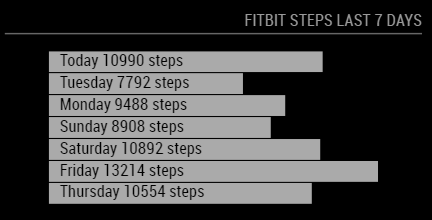

# MMM-JsonGraph
A module for the MagicMirror project which creates a SVG bar chart based on a list gathered from a json request.

## Example 1
End result:



Raw json response:

```json
{
    "fitbitWeekOverviewItems": [
        {
            "steps": 10256,
            "displayText": "Today\t10256 steps"
        },
        {
            "steps": 13214,
            "displayText": "Friday\t13214 steps"
        },
        {
            "steps": 10554,
            "displayText": "Thursday\t10554 steps"
        },
        {
            "steps": 12942,
            "displayText": "Wednesday\t12942 steps"
        },
        {
            "steps": 9478,
            "displayText": "Tuesday\t9478 steps"
        },
        {
            "steps": 10690,
            "displayText": "Monday\t10690 steps"
        },
        {
            "steps": 12792,
            "displayText": "Sunday\t12792 steps"
        }
    ]
}
```

Configuration:

```javascript
{
	module: 'MMM-JsonGraph',
	position: 'top_right',
	header: 'Fitbit steps last 7 days',
	config: {
		url: 'https://xyz/abc/get.json',
		arrayName: 'fitbitWeekOverviewItems',
		xAxisName: 'steps',
		textValue: 'displayText',
		updateInterval: 60000
	}
},
```

## Installation
````
git clone https://github.com/timdows/MMM-JsonGraph.git
````

## Config Options
| **Option** | **Default** | **Description** |
| --- | --- | --- |
| url | "" | The full url to get the json response from |
| arrayName | null | Define the name of the variable that holds the array to display |
| xAxisName | "" | Should be of the type number in order to determine the width of the bar |
| textValue | "" | The name of the variable in the array that holds text to display over the bar |
| updateInterval | 15000 | Milliseconds between the refersh |